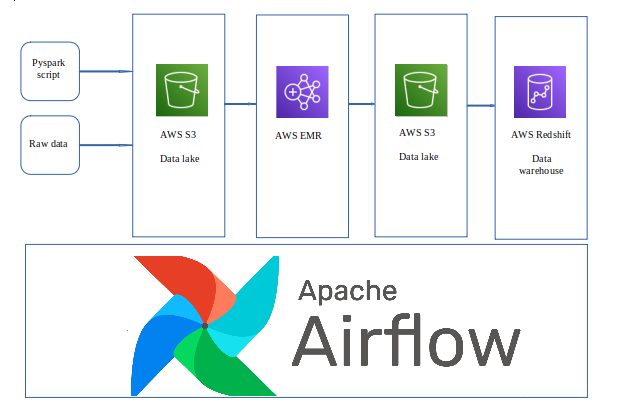
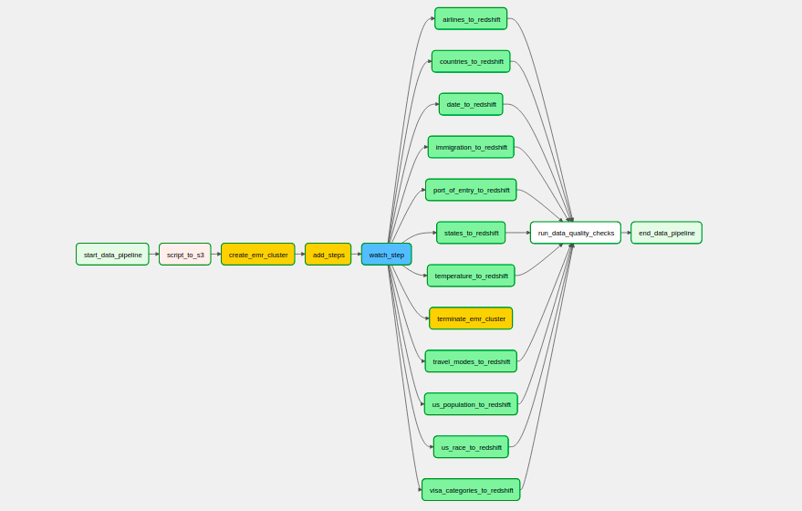

# Data Engineering Capstone Project
## Introduction
The National Travel and Tourism Office(NTTO) requires a data warehouse to carry out analyics on travel to the United states.

They want a data engineer to design and create a data pipeline and data warehouse. The data warehouse is meant to be used by analysts and anlytical software.

The data warehouse will be used to answer various questions regarding visitor arrivals to the United States. The data warehouse needs to be flexible enough to answer questions that have not yet been defined. Some of the questions to be answered include:
 1. International visitations for a selected year
 2. Visit count by world regions
 3. Top 5 overseas countries YTD
 4. Top 5 overseas countries Month

They have also placed importance on the requirement of data quality. They want the data pipelines to catch any discrepancies in the datasets.

## File Structure

```
.Project Folder
├── dags
│   ├── data ├── raw-data
│   ├── scripts ├── database ├── create_tables.sql
│   |           ├── spark ├── data_preparation.py
|   ├── dag_immigration.py
├── logs
├── plugins
│   ├── operators ├── data_quality.py
├── Data Dictionary.ods
```

## Datasets
The following datasets will be used:
- **I94 Immigration Data**: This data comes from the US National Tourism and Trade Office (https://travel.trade.gov/research/reports/i94/historical/2016.html). 
- **World Temperature Data**: This dataset came from Kaggle (https://www.kaggle.com/berkeleyearth/climate-change-earth-surface-temperature-data).
- **U.S. City Demographic Data**: This data comes from OpenSoft (https://public.opendatasoft.com/explore/dataset/us-cities-demographics/export/). 
- **Airport Codes**: This is a simple table of airport codes and corresponding cities (https://datahub.io/core/airport-codes#data). 
- **Airline Codes** from https://www.bts.gov/topics/airlines-and-airports/airline-codes
- **Country Codes** from https://countrycode.org/

## Data Exploration
The data sets were analysed to understand the data and find data quality issues. This exploratory data analysis was conducted using pyspark dataframe and pyspark SQL. 

### Assumtions:
A couple of assumtions were made when analysing the data. \
- In the I94 Immigration data, the country codes used for I94CIT(citizenship) & I94RES(residency) and are also provided in the SAS data dictionary, are not iso country codes. By comparing the country codes from https://countrycode.org/. The assumption is that the system, that generated the data, was using its own internal codes for countries. Futhermore, these codes were manually typed into the system thus having data with invalid country codes. Inorder to provide a relationship between the immigration data and temperature data, a mapping will be created to link the internal country codes with the actual country codes. This will be done by using the country names.

### Data Cleaning
For each data set, a number of steps were carried out to clean the data. These steps are described below:
1. I94 Immigration Data: 
    - The column matflag was converted to a Boolean. 
    - The date columns "arrdate" and "depdate" were converted from SAS date format to python date format.
    - A countries data set was created using the internal country codes used in the immigration data. These internal codes have been defined in the data dictionary file I94_SAS_Labels_Descriptions.SAS. This data was mapped to the iso country codes from https://countrycode.org/ to create a new countries data set. Based on the assumtions made about the country codes used in the I94 Immigration Data, the mapping of this data, using the country names, with the the country codes data set, left 33 countries unmatched. This is because of how the country names were typed i.e ST. LUCIA instead Saint Lucia. Also, some countries were renamed in the course of history i.e KAMPUCHEA to Cambodia. This unmatched data set had to be manually corrected using LibreOffice calc. The output was saved in the csv file unmatched_countries_updated.csv. This data set was used to create the final countries data set. 
2. World Temperature Data:
    - The data contains records with null values for AverageTemperature and AverageTemperatureUncertainty. These records were removed.
    - The country name was mapped to the new countries data set.
3. Data parsed from the file I94_SAS_Labels_Descriptions.SASPort: This file contains various data sets that were extracted manually and inserted into text files for processing. These include:
    - Travel Modes: A dataframe was created manually 
    - Visa Categories: A dataframe was created manually 
    - Port of entry: This required a UDF to parse the port of entry name and code from the text to create a dataframe.
4. U.S. City Demographic Data: This data set was broken into two data sets using distinct rows:
    - fact_us_population
    - fact_us_race


## Data Modeling
The data model has been designed with aim of answering the questions mentioned in the introduction. The model also needs to be flexible enough to answer questions that have not yet been defined. For this reason, the immigration data has been retained at the lowest level of granularity.

The schema for this project has been modeled using the star schema. This will allow optimized queries for analysis. The tables include:
### 1. Fact Tables: 
- fact_immigration: records of immigrations
- fact_temperature: data on climate change accross the world
- fact_us_population: Extracted from the U.S. City Demographic Data. It contains data on the us population
- fact_us_race: Extracted from the U.S. City Demographic Data. It contains data on the us population by race
### 2. Dimension Tables
- dim_airlines: List of all alirlines
- dim_countries: contains all the countries and their iso codes
- dim_date: this is the date dimension
- dim_port_of_entry: contains the ports of entry including their codes
- dim_states: contains all the US states
- dim_travel_modes: lists the available modes of travel ie air, sea etc
- dim_visa_categories: contains the visa codes ie Business, Pleasure etc

Please see the data dictionary in the root folder (Data Dictionary.ods)


## Design
The technologies used for this project include:
1. **AWS S3**: This was used as the datalake and staging area. It is best suited for holding the unstructured data that will be worked on.
2. **AWS EMR (Pyspark and Hadoop)**: AWS EMR was used because it provides a quick and inexpensive way to deploy a hadoop cluster. It alows us to deploy a hadoop cluster on demand, run our scripts, and terminate the cluster on completion. The whole process can be achieved programatically, making it easier to manage and is replicable. Hadoop was used because it is faster to process data on HDFS as compared to AWS S3.
3. **AWS Redshift**: Redshift was used because it uses columnar storage making it ideal for OLAP. It is also easy to scale when the demand increases.
4. **Airflow**: Airflow provides a flexible way to setup programmtic workflows. It's great at managing different kind of dependancies i.e task completion, dag run status etc.





## ETL Pipeline
The ETL pipeline is managed using Airflow. Airflow is used to orchestrate the following tasks:
- Upload pyspark script to S3
- Create AWS EMR cluster with Pyspark and Hadoop
- Add EMR steps: These are the actions carried out by EMR. They include:
    - Move raw data from S3 to HDFS
    - Prepare Data by running the data preparation pyspark script
    - Move clean data from HDFS to S3
- Watch EMR Step: This watches the last EMR step to completion
- Terminate AWS EMR Cluster
- Transfer data from S3 to Redshift Fact and Dimension Tables
- Run data quality checks



## Addressing Other Scenarios
### 1. If the data was increased by 100x.
The current setup uses HDFS to precess the data on EMR. This is faster than processing data from S3. The biggest change would be to increase the number of EMR core nodes to handle the processing of the addtional data within a reasonable timeframe.

### 2. If the pipelines were run on a daily basis by 7am.
Partition the immigration data by date, and schedule the pipelines to batch process the data on a daily basis.

### 3. If the database needed to be accessed by 100+ people.
To accommodate a higher number of users accessing the data warehouse without impacting performance, one can scale the redshift cluster by adding more nodes.


## How to Run this Project
### 1. Prepare Infrastructure
- Create a Redshift Cluster on AWS. 
- Copy the scripts from create_tables.sql (located in ./dags/scripts/database/) and run them on the Redshift Query editor.

- Create s3 bucket using aws cli that has public read write access
```
aws s3api create-bucket --bucket <BUCKET_NAME>--acl public-read-write --region us-west-2 --create-bucket-configuration LocationConstraint=us-west-2 --profile <PROFILE_NAME>
```

- Check if default EMR roles have been created
```
aws iam list-roles --profile <PROFILE_NAME> | grep 'EMR_DefaultRole\|EMR_EC2_DefaultRole' 
```

- Create EMR default roles
```
aws emr create-default-roles --profile <PROFILE_NAME>
```

### 2. Run the Data Pipeline
- Edit the file dl.cfg and update the value for BUCKET_NAME with the name of the S3 bucket you created earlier. Do not include quotes. This file is only used by dag_immigration.py
- Edit the file data_preparation.py and reaplce \<ENTER AWS ACCESS KEY ID> and \<ENTER AWS SECRET ACCESS KEY> with your aws access key and aws secret access key respectively. This is required if you plan to change the output location to AWS S3.
- Upload the data folder to the S3 bucket you created
- Copy the files from the Project folder to the airflow folder
- Open the airflow UI on the browser
- Configure airflow connection to Redshift:
    - Connection Id: redshift
    - Connection Type: Postgres
    - Schema: 
    - Login:
    - Password:
    - Port: 5439
- Configure airflow connection to AWS:
    - Connection Id: aws_credentials
    - Connection Type: Amazon Web Services
    - Login:
    - Password:
    - Extra: {"region_name": "us-west-2"}
- Navigate to DAGs on Airflow UI and start the DAG "dag_immigration"

### Known Issues
Sometimes the script run on EMR can fail if you are using pre-existing EMR default roles that may have been altered. In this case, delete these roles and re-create them.
